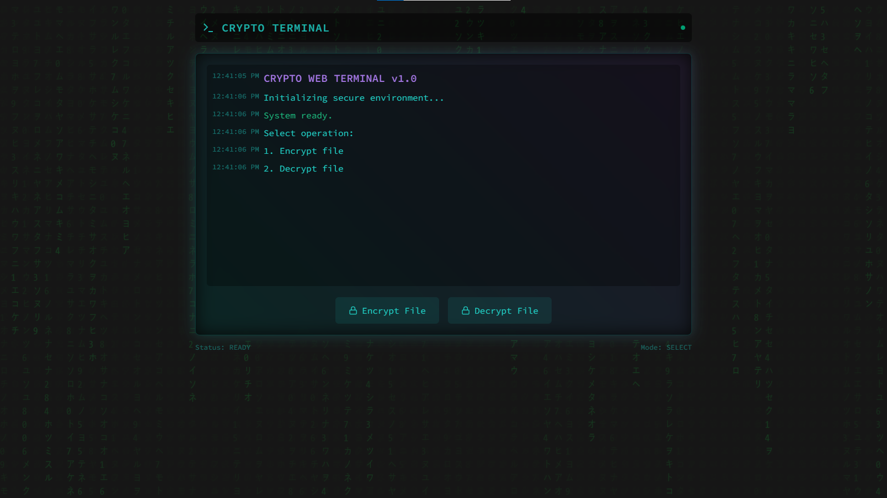

# Crypto Terminal

A sleek, terminal-like web application that allows users to encrypt and decrypt files using the AES algorithm. With a matrix-style background and smooth animations, this app provides a cyberpunk aesthetic while ensuring secure file operations.

 <!-- Optionally add a screenshot -->

## Table of Contents
- [Features](#features)
- [Technologies Used](#technologies-used)
- [Installation](#installation)
- [Usage](#usage)
- [Contributing](#contributing)
- [License](#license)

## Features
- **File Encryption**: Upload a file and receive an encrypted version, bundled in a ZIP file.
- **File Decryption**: Upload an encrypted ZIP file and retrieve the decrypted file.
- **Matrix-Style Background**: A retro-futuristic animation effect that adds a unique, cyberpunk vibe.
- **Interactive Terminal UI**: Real-time logs and status updates while processing the file.

## Technologies Used
- **Frontend**: 
  - HTML, CSS (TailwindCSS), and JavaScript
  - Matrix background animation using the HTML `<canvas>` element
- **Backend**: 
  - Flask (Python web framework)
  - Cryptography (Fernet encryption)
- **Styling**: 
  - TailwindCSS for responsive and modern design
  - Google Fonts (Source Code Pro) for terminal-like fonts

## Installation

### Backend (Flask API)

1. Clone the repository:
    ```bash
    git clone https://github.com/jaiiiiiiiii/crypto-terminal.git
    cd crypto-terminal
    ```

2. Create a virtual environment:
    ```bash
    python3 -m venv venv
    source venv/bin/activate  # On Windows, use `venv\Scripts\activate`
    ```

3. Install required dependencies:
    ```bash
    pip install -r requirements.txt
    ```

4. Run the Flask server:
    ```bash
    python app.py
    ```

The server will run on `http://localhost:5000`.

### Frontend (Web Interface)

1. The frontend files are already set up. You can open the `index.html` file directly in your browser.

2. The frontend communicates with the Flask API on the backend. Make sure the Flask server is running before interacting with the UI.

## Usage

1. Open the `index.html` file in your browser.
2. Choose an operation:
    - **Encrypt File**: Click the "Encrypt File" button and select a file. You will receive a ZIP file containing the encrypted version of the file.
    - **Decrypt File**: Click the "Decrypt File" button and upload a ZIP file containing the encrypted file. You will receive the decrypted file as a `.txt` file.
3. Follow the on-screen logs and status updates for real-time feedback on the process.

## Contributing

We welcome contributions! To contribute to this project:

1. Fork the repository.
2. Clone your fork:
    ```bash
    git clone https://github.com/jaiiiiiiiii/crypto-terminal.git
    ```
3. Create a new branch:
    ```bash
    git checkout -b feature-branch
    ```
4. Make your changes and commit them:
    ```bash
    git add .
    git commit -m "Add new feature"
    ```
5. Push to your fork:
    ```bash
    git push origin feature-branch
    ```
6. Open a pull request on the main repository.

## License

This project is licensed under the MIT License - see the [LICENSE](LICENSE) file for details.
